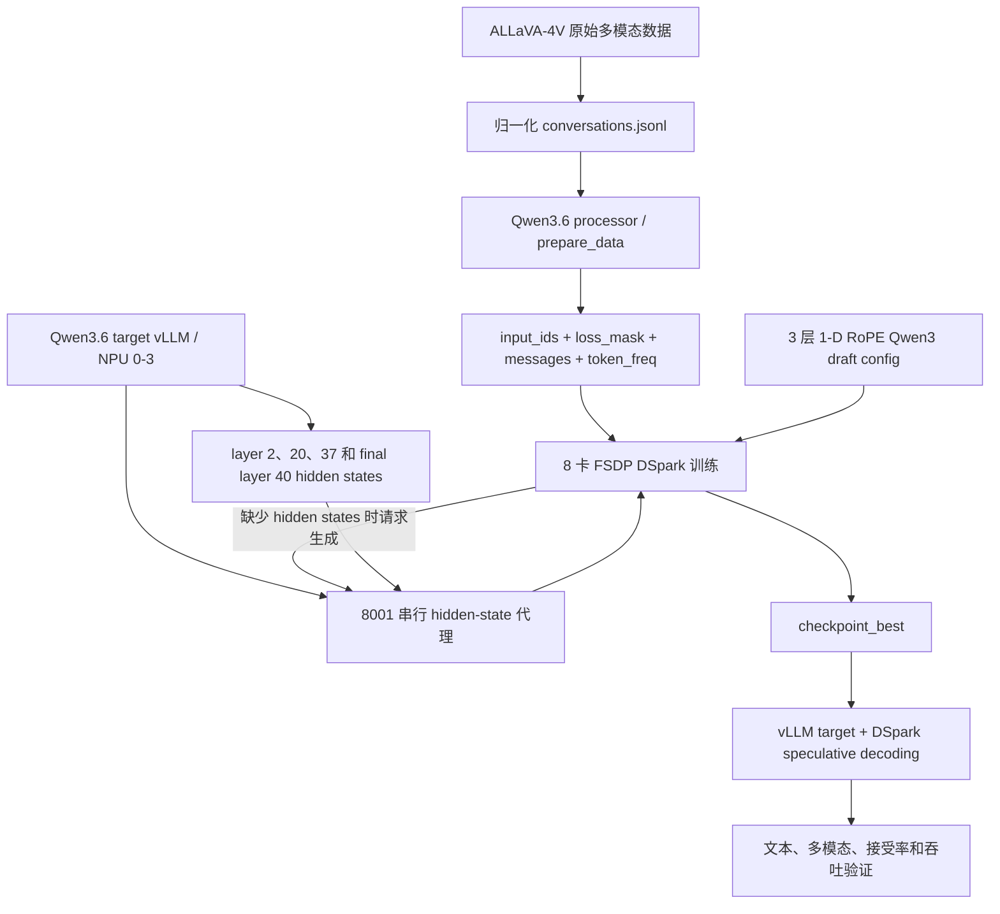

# Qwen3-Omni DSpark 框架适配与 Qwen3.6 DSpark 训练方案

本文汇总两项相互关联但边界不同的工作：

1. **Qwen3-Omni DSpark 框架适配**：对应 vLLM PR
   [#52560](https://github.com/vllm-project/vllm/pull/52560) 和 vLLM-Ascend PR
   [#14392](https://github.com/vllm-project/vllm-ascend/pull/14392)，解决 checkpoint
   识别、配置校验、target hidden state、词表加载和 NPU runtime 接入问题；
2. **Qwen3.6-35B-A3B DSpark 训练方案**：使用 msModelSpec、ALLaVA-4V 和 Ascend
   A2 16 卡建立在线 hidden-state 训练、checkpoint serving 与验证流程。

两部分的关系是：框架适配定义“一个合格的 DSpark checkpoint 如何被 vLLM/NPU
识别并执行”，训练方案定义“如何产生这样的 checkpoint 并验证效果”。

---

## 第一部分：Qwen3-Omni DSpark 框架适配

### 1. PR 目标与最终结论

本次 PR 的目标是在不依赖现成 Qwen3-Omni DSpark 权重的前提下，打通以下框架链路：

```text
Qwen3-Omni target checkpoint
        +
architecture = Qwen3OmniDSparkModel 的独立 draft checkpoint
        ↓
vLLM SpeculativeConfig 识别与契约校验
        ↓
Qwen3-Omni thinker 输出指定层 auxiliary hidden states
        ↓
Qwen3DSparkForCausalLM 共享 draft runtime
        ↓
DSparkSpeculator 并行提出 token block
        ↓
target verifier 接受或拒绝候选 token
        ↓
vLLM-Ascend 使用 AscendQwen3DSparkForCausalLM 在 NPU 执行
```

最终设计不是为 Qwen3-Omni 复制一套 DSpark forward，而是将两个概念分开：

| 概念 | 最终设计 |
|---|---|
| checkpoint 身份 | 使用独立 architecture：`Qwen3OmniDSparkModel` |
| vLLM 通用 runtime | 直接映射到 `Qwen3DSparkForCausalLM` |
| Ascend runtime | 直接映射到 `AscendQwen3DSparkForCausalLM` |
| Qwen3-Omni 专属逻辑 | target thinker hidden states、配置契约和兼容性校验 |
| Qwen3 共用逻辑 | draft decoder、Markov head、confidence head、词表映射和 DSpark speculator |

因此，`Qwen3OmniDSparkModel` 仍然是必须写入 checkpoint config 的模型身份，但不再
对应一个没有行为差异的空 Python wrapper 类。

### 2. 两阶段提交的演进

#### 2.1 vLLM 第一阶段

提交：

```text
ea6467cca [Model] Add Qwen3-Omni DSpark support
```

第一阶段建立了完整功能骨架：

- 注册 Qwen3-Omni DSpark architecture；
- 为 Qwen3-Omni thinker 增加 auxiliary hidden-state 输出；
- 增加独立 checkpoint 契约校验；
- 衔接 msModelSpec DSpark config；
- 处理 expanded input vocabulary 和 reduced output vocabulary；
- 增加 registry、config、hidden-state 和权重加载测试。

初版曾增加 `Qwen3OmniDSparkForCausalLM` 空 wrapper，并增加针对 draft logits cache
尺寸的临时 workaround。

#### 2.2 vLLM 检视后收敛

提交：

```text
3e7f8ae5f [Model] Reuse Qwen3 DSpark implementation for Qwen3-Omni
```

根据检视意见做了两项收敛：

1. `Qwen3OmniDSparkModel` 直接注册到 `Qwen3DSparkForCausalLM`，删除空 wrapper
   及只为 wrapper 服务的 subclass hook；
2. 主线 PR #53017 已让 `gumbel_sample` 使用 draft logits cache tensor 的真实 stride，
   因而删除 Qwen3-Omni 专属的 `self.draft_logits` resize workaround 和对应测试。

最终 vLLM PR 为 11 个文件、657 行新增、19 行删除。

#### 2.3 vLLM-Ascend 两阶段

提交：

```text
daaeac4cb feat(model): add Qwen3-Omni DSpark support
078d886d8 refactor(model): reuse Qwen3 DSpark for Qwen3-Omni
```

Ascend 第一阶段增加注册、wrapper 和 target QuaRot 修复；第二阶段与 vLLM 设计对齐，
删除空 `AscendQwen3OmniDSparkForCausalLM` wrapper，architecture 直接映射到
`AscendQwen3DSparkForCausalLM`。最终 Ascend PR 只修改 3 个文件。

### 3. vLLM 服务启动与调用链

#### 3.1 SpeculativeConfig 初始化

用户启动服务时提供 target 模型和 DSpark draft checkpoint，例如：

```bash
vllm serve /path/to/qwen3-omni-target \
  --speculative-config '{
    "method": "dspark",
    "model": "/path/to/qwen3-omni-dspark",
    "num_speculative_tokens": 7,
    "parallel_drafting": true,
    "draft_sample_method": "greedy"
  }'
```

启动阶段的逻辑顺序为：

1. target checkpoint 构造 target `ModelConfig`；
2. speculative config 加载 draft checkpoint 的 Hugging Face config；
3. 根据 checkpoint metadata 识别 `method=dspark`；
4. msModelSpec 格式先经过 `update_dspark` 转换；
5. registry 根据 `architectures` 解析 draft runtime；
6. `_validate_qwen3_omni_dspark` 对 target/draft 契约做 fail-fast 校验；
7. 自动设置 `parallel_drafting=true`；
8. EngineCore/model runner 初始化 target 与 draft；
9. scheduler 在 decode 阶段触发 DSpark proposer 和 target verifier。

如果用户只设置 `method=dspark` 和 token 数、没有提供独立 draft 路径，原有逻辑仍可
回退到 target checkpoint 内置 DSpark 权重；Qwen3-Omni 本方案要求使用独立且明确标记
`Qwen3OmniDSparkModel` 的 draft checkpoint。

#### 3.2 模型注册

vLLM registry 最终增加：

```python
"Qwen3OmniDSparkModel": ("qwen3_dspark", "Qwen3DSparkForCausalLM")
```

它表达两件事：

- config 必须明确声明这是 Qwen3-Omni 训练得到的 DSpark checkpoint；
- 运行时 decoder 结构与通用 Qwen3 DSpark 一致，因此复用同一个实现。

不能把 checkpoint architecture 改回 `Qwen3DSparkModel` 来规避校验。Qwen3-Omni target
启动时会拒绝 generic Qwen3 architecture，防止把未经转换、hidden-state 契约不确定的
Qwen3 draft 误接入生产服务。

#### 3.3 target hidden-state 输出

DSpark 需要 target 多个中间层的 hidden states。Qwen3-Omni 的文本模型不仅包含普通
decoder layer，还会在前几层叠加 DeepStack 多模态 embedding。因此抽取时机必须在
当前层 DeepStack addition 完成之后。

本次修改使 `Qwen3OmniMoeThinkerForConditionalGeneration` 实现 `SupportsEagle3`
接口，并在文本模型 forward 中：

1. 根据配置初始化 auxiliary hidden-state 列表；
2. 执行当前 decoder layer；
3. 若当前层属于 DeepStack 区间，先加上对应 `deepstack_input_embeds`；
4. 再调用 `_maybe_add_hidden_state` 保存该层输出；
5. 最终返回 `hidden_states` 或 `(hidden_states, aux_hidden_states)`。

顺序必须是“decoder layer → DeepStack addition → collect”。若在 DeepStack addition
之前收集，训练使用的 hidden state 与真实 target 下一层输入不一致，多模态条件会缺失。

#### 3.4 draft 加载

`load_dspark_model` 使用 target `VllmConfig` 构造 draft config，同时替换：

- draft attention backend；
- draft non-causal attention 配置；
- draft KV cache dtype；
- draft quantization config。

然后通过 registry 实例化 `Qwen3DSparkForCausalLM`。该 runtime 内部包含：

- Qwen3/DFlash 风格 draft decoder；
- DSpark Markov head；
- 可选 confidence head；
- reduced-vocab `draft_id_to_target_id` 映射；
- draft logits、Markov bias、confidence 和 token remap 接口。

Pipeline Parallel 当前不支持 DSpark，初始化时会明确报错；target/draft 的 Tensor
Parallel 和 NPU 执行由现有 vLLM/vLLM-Ascend 并行框架负责。

#### 3.5 decode 阶段

框架侧的主要运行逻辑为：

```text
target forward
  -> 返回最终 hidden state + 指定层 aux hidden states
  -> DSpark combine_hidden_states / FC 融合
  -> draft decoder 并行计算一个 block
  -> 在 draft vocabulary 中叠加 Markov bias
  -> draft id 映射为 target token id
  -> confidence/top-k/greedy 选择候选
  -> target verifier 校验候选
  -> 接受前缀并进入下一轮 scheduler
```

`parallel_drafting=true` 是 DSpark 正常路径。block size 与
`num_speculative_tokens` 必须完全一致，避免使用与训练不同的候选长度。

### 4. Qwen3-Omni checkpoint 契约

#### 4.1 必需 architecture

```json
{
  "architectures": ["Qwen3OmniDSparkModel"]
}
```

其他模型并不统一使用这个 architecture：

- Qwen3：`Qwen3DSparkModel`；
- Qwen3-Omni：`Qwen3OmniDSparkModel`；
- Gemma4、Kimi K3、DeepSeek V4 使用各自的 DSpark architecture。

architecture 表示 checkpoint 契约和适用 target，不等于每个 architecture 都必须有
一份独立 Python forward 类。

#### 4.2 启动时严格校验项

当 target 被识别为 Qwen3-Omni 时，`_validate_qwen3_omni_dspark` 检查：

| 校验项 | 要求 |
|---|---|
| architecture | 必须包含 `Qwen3OmniDSparkModel` |
| block size | 正整数且等于 `num_speculative_tokens` |
| target hidden size | `target_hidden_size` 等于 thinker text hidden size |
| draft hidden size | `hidden_size` 等于 thinker text hidden size |
| attention geometry | attention heads、KV heads、head dim 与 target text config 相同 |
| target layer IDs | 非空、整数、唯一、严格递增、位于 target text layer 范围内 |
| auxiliary states | `use_aux_hidden_state=true` |
| Markov rank | 正整数 |
| Markov type | 当前必须为 `vanilla` |
| anchor semantics | `sample_from_anchor=true` 且 `dspark_bonus_anchor=false` |
| input vocabulary | `vocab_size >= target tokenizer vocabulary` |
| output vocabulary | `0 < draft_vocab_size <= target vocabulary` |
| mask/noise token | 必须落在 draft input vocabulary 内 |
| position encoding | draft 使用逻辑 1-D RoPE，不允许 `mrope_section` |

这些检查把权重错误从 NPU forward 阶段提前到 EngineCore 初始化阶段，避免运行数轮后才
因 shape、层号或 token 映射错误崩溃。

#### 4.3 msModelSpec config 桥接

msModelSpec checkpoint 的外层配置通过 `update_dspark` 转为 vLLM 可用的
`PreTrainedConfig`：

- 保留 `Qwen3OmniDSparkModel`，不再强制覆盖为 `Qwen3DSparkModel`；
- legacy `DSparkSpeculator` 在没有受支持 architecture 时仍回退为 Qwen3；
- `aux_hidden_state_layer_ids` 同时写入
  `eagle_aux_hidden_state_layer_ids`；
- 按 DSpark 的层号语义生成 `target_layer_ids = aux_id - 1`；
- 保留 `draft_vocab_size`、`target_hidden_size`、`mask_token_id`、
  `markov_rank`、`markov_head_type`、`block_size`、confidence head 和
  `use_aux_hidden_state`；
- 将 `sample_from_anchor` 映射为相反语义的 `dspark_bonus_anchor`。

训练导出时必须确保 `sample_from_anchor=true`。如果 msModelSpec 仍使用默认 false，
Qwen3-Omni 的启动校验会拒绝 checkpoint，因为两种 anchor 语义会改变实际候选 token
数量和训练目标。

### 5. 词表与权重加载安全

Qwen3-Omni tokenizer、draft input vocabulary 和 draft output vocabulary 可能不同，
因此不能无条件复用 target embedding 和 LM head。

#### 5.1 embedding 共享

仅在以下条件同时满足时共享 target `embed_tokens`：

- draft config 的 input `vocab_size` 等于 target vocabulary；
- checkpoint 没有自己的 embedding 权重；
- target embedding 存在且 shape 兼容。

如果 draft input vocabulary 扩展了额外 noise token，checkpoint 必须携带自己的
`embed_tokens`，否则加载时直接报错。

#### 5.2 LM head 共享

仅当 draft output vocabulary 等于 target vocabulary，且 checkpoint 没有自己的
LM head 时，才允许共享 target `lm_head`。

如果 `draft_vocab_size < target_vocab_size`，checkpoint 必须包含：

- 自己的 reduced-vocab `lm_head`；
- `d2t`/`draft_id_to_target_id` 映射。

训练用的 `t2d` 不在推理侧加载；采样发生在 draft vocabulary 中，随后使用 d2t 将
draft token id 转为 target token id。

#### 5.3 为什么不再 resize draft logits cache

旧 workaround 假设 Gumbel sampling 用传入 logits 的最后一维推导 cache stride，
reduced vocabulary 时可能与预分配 cache 不同。主线 #53017 已改为读取 draft logits
cache tensor 自身的真实 stride，因此模型专属 resize 不但冗余，还会增加显存和维护
成本，最终 PR 已将其删除。

### 6. vLLM-Ascend/NPU 适配

#### 6.1 Ascend registry

Ascend 插件在加载后覆盖同名 architecture 的实现：

```python
ModelRegistry.register_model(
    "Qwen3OmniDSparkModel",
    "vllm_ascend.models.qwen3_dspark:AscendQwen3DSparkForCausalLM",
)
```

这意味着：

- vLLM core 负责识别 config、输出 hidden states 和执行 DSpark 通用调度；
- vLLM-Ascend 负责把 draft runtime 替换成 NPU 实现；
- 不需要 GPU 版 Qwen3-Omni wrapper，也不需要 Ascend 专属 Omni wrapper；
- 虽然通用 worker 路径包含 `gpu/spec_decode` 目录名，实际算子和模型实现会通过
  vLLM-Ascend 插件落到 NPU。

#### 6.2 Ascend runtime 复用内容

`AscendQwen3DSparkForCausalLM` 继续提供：

- Ascend 版 confidence head；
- FC rotation 权重预处理；
- Ascend 权重加载；
- 通用 Qwen3 DSpark decoder、Markov head 和 d2t 逻辑。

#### 6.3 target QuaRot 修复

DSpark 初始化过程中，`vllm_config.quant_config` 可能已经被替换成 draft quant config。
如果 draft 是 BF16、target 是 QuaRot 量化，直接检查 draft config 会错误认为不需要
rotation。

Ascend PR 改为：

1. 读取 `vllm_config.model_config`，即 target model config；
2. 使用 target model config 和 load config 重新解析 target quant config；
3. 从 `quant_description.optional.quarot.rotation_map.global_rotation` 获取矩阵路径；
4. 只对包含 `fc.` 的 draft 权重应用 rotation；
5. 其他 embedding、LM head 和 DSpark 权重保持原值。

因此，一个不量化的 standalone draft 不会再屏蔽量化 target 所要求的 FC rotation。

### 7. 修改文件与“原本—修改后”

#### 7.1 vLLM core

| 文件 | 原本 | 修改后 |
|---|---|---|
| `vllm/model_executor/models/registry.py` | 不认识 Qwen3-Omni DSpark | architecture 直接映射到 `Qwen3DSparkForCausalLM` |
| `vllm/model_executor/models/qwen3_omni_moe_thinker.py` | thinker 不提供 DSpark 所需多层 hidden states | 实现 `SupportsEagle3`，在 DeepStack 后收集 auxiliary states |
| `vllm/config/speculative.py` | 只按通用 DSpark 处理，错误 checkpoint 可能晚失败 | 新增 Qwen3-Omni 识别和完整 checkpoint 契约校验 |
| `vllm/transformers_utils/configs/speculators/algos.py` | msModelSpec architecture 被统一改成 Qwen3 | 保留 Omni architecture 和 DSpark 关键字段 |
| `vllm/model_executor/models/qwen3_dflash.py` | 部分配置只从嵌套 dflash/eagle config 读取 | top-level `use_aux_hidden_state`、`mask_token_id` 也可用 |
| `vllm/model_executor/models/qwen3_dspark.py` | reduced/expanded vocab 缺权重时可能延迟失败 | 强制校验 embedding、LM head 和 d2t 权重完整性 |
| `vllm/v1/worker/gpu/spec_decode/dspark/utils.py` | 可能无条件共享 target embedding/LM head | 只有 input/output vocabulary 相等时才共享 |
| 测试文件 | 没有 Omni DSpark 契约覆盖 | 增加 registry、config bridge、hidden state、vocab contract 测试 |

#### 7.2 vLLM-Ascend

| 文件 | 原本 | 修改后 |
|---|---|---|
| `vllm_ascend/models/__init__.py` | NPU registry 不认识 Qwen3-Omni DSpark | 映射到 `AscendQwen3DSparkForCausalLM` |
| `vllm_ascend/models/qwen3_dspark.py` | rotation path 可能受 draft quant config 影响 | 从 target quant config 解析 QuaRot 并处理 FC 权重 |
| `tests/ut/model_executor/test_qwen3_dspark.py` | 无 Omni registry/target rotation 覆盖 | 验证共享 runtime、target rotation 和 FC-only rotation |

### 8. PR 测试结果与尚未完成项

vLLM PR 已完成：

- Ruff check 和 format：通过；
- registry 直接加载 smoke：通过；
- config/msModelSpec bridge：21 passed；
- vocabulary/weight contract：3 passed；
- `git diff --check`：通过。

vLLM-Ascend PR 已完成：

- Ruff check 和 format：通过；
- targeted CPU unit tests：3 passed；
- registry 与 target QuaRot smoke：通过；
- `git diff --check`：通过。

本地没有 Ascend NPU，也没有正式训练的 Qwen3-Omni DSpark checkpoint，因此尚未声明：

- NPU eager 端到端通过；
- ACLGraph 端到端通过；
- 输出正确性和接受率；
- 显存、吞吐和时延收益。

### 9. NPU 接入验收顺序

拿到 msModelSpec 训练产物后，建议按以下顺序验证：

1. 检查 `config.json` architecture 和全部契约字段；
2. eager 模式启动 EngineCore，确认通过 fail-fast 校验；
3. 确认 draft 权重、confidence head、LM head 和 d2t 全部加载；
4. 使用单条纯文本请求验证 DSpark proposer/verifier；
5. 使用图片、音频或视频请求验证 Omni hidden-state 路径；
6. 对照无投机 target 的 greedy 输出；
7. 统计 acceptance length、accepted token ratio、显存和吞吐；
8. eager 稳定后再开启 ACLGraph；
9. 图模式单独检查动态 shape、block size 和 hidden-state buffer 捕获。

Qwen3-Omni 框架适配只固定 checkpoint 契约，没有把具体层数、vocabulary 数值或权重
内容写死在 runtime。训练模型可以有不同 draft layer 数，但 hidden size、attention
geometry、target layer IDs、词表映射和 block size 必须满足启动校验。

---

## 第二部分：Qwen3.6-35B-A3B DSpark 在线训练方案

### 1. 适配目标

本次适配的目标是在 Ascend A2 16 卡环境中，为多模态模型
`Qwen3.6-35B-A3B` 建立一条可执行、可恢复、可验证的 DSpark 在线训练与推理
链路：

1. 使用 ALLaVA-4V 多模态数据生成与 target 模型一致的 token 和消息结构；
2. 由运行在 vLLM 上的 Qwen3.6 target 实时生成 verifier hidden states；
3. 使用 msModelSpec 训练一个 3 层、纯文本结构的 Qwen3 DSpark 草稿模型；
4. 训练完成后，将 `checkpoint_best` 直接作为 vLLM 的 DSpark draft checkpoint；
5. 在同一服务中验证纯文本与图片理解请求，并进一步评估投机接受率和性能。

本方案不直接修改 `msModelSpec-Dev`，而是在其已有的 `prepare_data.py`、
`launch_vllm.py` 和 `train.py` 能力外增加数据归一化、draft config 构造、并发控制、
服务启动和诊断脚本。

### 2. 总体设计



完整数据流为：

```text
ALLaVA-4V
  -> conversations.jsonl
  -> prepared Arrow dataset
  -> FSDP rank 向 8001 代理请求 hidden states
  -> 代理串行转发到 8000 target vLLM
  -> target 处理文本和图片并导出 verifier hidden states
  -> 当前 batch 读取 hidden states 后删除临时文件
  -> DSpark 前向、loss、反向和 checkpoint
  -> checkpoint_best 接入 vLLM speculative-config
```

### 3. 关键适配决策

#### 3.1 多模态 target 与纯文本 draft 的职责划分

Qwen3.6 target 是多模态模型，但 DSpark draft 不复制视觉编码器，也不直接实现
Qwen3.6 的完整多模态网络。两侧职责如下：

| 组件 | 结构与职责 |
|---|---|
| Qwen3.6 target | 使用原始 processor 处理文本和图片，生成 target token 序列及包含视觉信息的 verifier hidden states |
| DSpark draft | 使用 3 层纯文本 Qwen3 decoder，根据 token、target hidden states 和 Markov 信息预测后续 token block |
| vLLM verifier | 对 draft token 做 target 验证，只接受与 target 分布一致的 token |

因此，多模态能力由 target hidden states 注入训练过程。draft 本身可以保持文本 decoder
结构，但训练数据仍需包含图片和多模态 messages，否则无法覆盖真实多模态请求中的
hidden-state 分布。

#### 3.2 draft attention 几何与 target text backbone 保持一致

`02_build_draft_config.py` 从 target 的 `text_config` 读取并复制以下结构字段：

- `hidden_size`；
- `intermediate_size`；
- `num_attention_heads`；
- `num_key_value_heads`；
- `head_dim`；
- `hidden_act`；
- `max_position_embeddings`；
- `rms_norm_eps`、`attention_bias` 和 `attention_dropout`；
- `rope_theta`。

这样保证 draft 接收的 target hidden states 与自身 decoder 隐藏维度一致，同时保证
attention head、KV head 和 head dimension 是一套完整、可加载的结构。

draft 的差异是：

- 只保留 3 个 decoder layer；
- 使用 `sliding_attention`，默认 sliding window 为 2048；
- 使用标准 1-D RoPE；
- 不复制多模态 target 的 `mrope_section` 和 `partial_rotary_factor`；
- `tie_word_embeddings=false`，由 DSpark checkpoint 自己管理 embedding 和输出头。

这里不能直接复制 Qwen3.6 多模态 MRoPE 配置。draft 输入是已经对齐的 token 和 hidden
states，并不直接进行图片网格的位置编码；把 MRoPE 字段放入普通 Qwen3 decoder
反而会造成 config 与实际 forward 结构不一致。

#### 3.3 hidden state 一致性

训练和推理能否正确衔接，关键不是只让 hidden size 相同，而是确保 token 序列、模型、
抽取位置和层选择都一致。本方案采用以下约束：

1. 数据准备和 hidden-state 服务使用同一个 `TARGET_MODEL`；
2. `prepare_data.py` 使用 target 自带的 tokenizer/processor 生成 `input_ids` 和
   `messages`；
3. target vLLM 收到相同的 `messages`，重新渲染并执行多模态 forward；
4. 显式抽取 target layer `2、20、37`，`launch_vllm.py` 再附加最终层 `40`；
5. 训练侧和 target 服务侧使用同一个 hidden-state 文件目录；
6. hidden states 以 `bfloat16` 训练；
7. 若 token 序列与 target 服务重新渲染的 prompt 不一致，立即报
   `Prompt token IDs mismatch`，不允许静默继续训练。

层号、层数和 hidden size 是当前 `Qwen3.6-35B-A3B` 配置的一部分。更换 target
checkpoint 后，必须重新检查 target 的 `text_config.num_hidden_layers`，并重新选择
`TARGET_LAYER_IDS`，不能机械复用 `2 20 37 + final 40`。

#### 3.4 在线生成 hidden states

训练使用：

```text
--on-missing generate
--on-generate delete
--hidden-states-backend file
```

含义是：

- 当前样本没有 hidden-state 文件时，训练进程调用 target vLLM 在线生成；
- 文件生成后由当前 batch 消费；
- 消费完成后删除文件，避免训练集规模扩大时长期占用大量磁盘；
- 训练中断恢复时，缺失的 hidden states 会重新生成。

这种模式降低了磁盘需求，但 target vLLM 必须在训练和验证期间持续运行。

#### 3.5 串行代理解决并发生成和异步写盘问题

8 个 FSDP rank 会同时请求 target hidden states。仅将 target vLLM 的
`max_num_seqs` 设置为 1，仍不能保证以下两个阶段完全串行：

1. target forward；
2. vLLM 返回 hidden-state handle 后的异步文件写入。

`03a_serial_vllm_proxy.py` 在 8001 端口增加全局请求锁：

- `/v1/chat/completions` 和 `/v1/completions` 一次只转发一个请求；
- 从返回值读取 `hidden_states_path` 或 `handle`；
- 等待对应 `.lock` 文件释放；
- 确认 hidden-state 文件已经存在后，才允许下一个 rank 请求。

训练必须访问 8001，不能绕过代理直接访问 target 的 8000 端口。该设计牺牲一部分
hidden-state 生成吞吐，换取多 rank 训练的稳定性，并规避观察到的 verifier hidden
states NaN 和未完成文件读取问题。

### 4. 数据适配流程

#### 4.1 ALLaVA 数据归一化

`01_normalize_allava.py` 完成以下工作：

1. 流式读取大型 ALLaVA JSON，避免整体加载造成内存峰值；
2. 将顶层 `image/images` 和消息中的 `<image>` 标记转换成显式图片 content part；
3. 将图片路径规范化为本地绝对路径并检查文件存在；
4. 将超过 `MAX_IMAGE_PIXELS` 或 `MAX_IMAGE_SIDE` 的图片等比例缩放到工作目录；
5. 保留有效的 user/assistant 对话结构；
6. 默认发现坏样本立即停止，只有显式设置 `SKIP_INVALID_SOURCE_ROWS=1` 才跳过。

默认图片限制为约 100 万像素、最长边 2048。限制图片尺寸的目的不是降低视觉精度，
而是控制视觉 token 数量，在 `SEQ_LENGTH=4096` 内为 assistant 回答保留训练 token。

#### 4.2 prepared dataset

`01_prepare_data.sh` 调用 msModelSpec 的 `scripts/prepare_data.py`，生成：

- `input_ids`；
- `loss_mask`；
- 可再次发送给 vLLM 的多模态 `messages`；
- `token_freq.pt`，用于构造 32000 词的高频 draft vocabulary；
- `dataset_info.json` 和 Arrow dataset。

随后 `02_inspect_prepared_data.py` 检查：

- `input_ids` 与 `loss_mask` 长度是否相同；
- 样本是否超过 `SEQ_LENGTH`；
- assistant 有效 token 是否足够；
- 序列长度的 min、p50、p95、max 和截断比例。

任何 tokenizer、processor、图片处理、序列长度或样本数量变化后，都应重新执行
prepare，不能继续使用旧 prepared dataset。

### 5. 训练配置与资源规划

#### 5.1 NPU 分配

默认 16 卡分配为：

```text
NPU 0-3  : Qwen3.6 target vLLM，TP=4
NPU 4-7  : 预留
NPU 8-15 : DSpark 训练，8 rank FSDP
```

target OOM 时可改为 NPU 0-7、TP=8，但必须同时重新规划训练卡，避免两个进程看到
重叠设备。

#### 5.2 为什么使用 FSDP

普通 DDP 会在每张训练卡上复制完整参数、梯度和优化器状态，无法解决单卡模型状态
OOM。`--fsdp-shard` 将这些状态分片到 8 张卡。

FSDP 不会自动分片本方案的 DSpark attention activation，因此 `MAX_ANCHORS` 仍是
主要显存控制参数：

- 32000 draft vocabulary：默认 `MAX_ANCHORS=512`；
- 仍然 OOM：先降到 256；
- 248320 完整 vocabulary：默认降到 64，必要时降到 32。

只有 anchors 调整仍不足时，才考虑降低 `SEQ_LENGTH`，并在修改后重新 prepare 数据。

#### 5.3 DSpark 核心超参数

| 参数 | 当前值 | 作用 |
|---|---:|---|
| draft layers | 3 | 控制草稿网络深度和开销 |
| block size | 7 | 一次并行提出 7 个候选 token |
| target layer ids | 2, 20, 37 + final 40 | 提供浅层、中层、深层和最终层 target 表征 |
| draft vocab size | 32000 | 默认缩减词表，降低训练与推理开销 |
| Markov rank | 32 | 低秩 Markov head 配置 |
| confidence head | enabled | 训练候选置信度 |
| confidence with Markov | enabled | confidence head 联合 Markov 信息 |
| loss | 0.1 CE + 0.9 TV | 兼顾 token 分类和 target 分布拟合 |
| attention implementation | eager | 优先保证训练稳定并便于排错 |
| hidden-state dtype | bfloat16 | 与 NPU 训练和 target 输出匹配 |
| optimizer | AdamW | 默认优化器 |
| scheduler | cosine + 3% warmup | 学习率调度 |

训练时的 `BLOCK_SIZE` 必须与服务时的 `num_speculative_tokens` 保持一致。

### 6. 词表适配

#### 6.1 默认 32000 缩减词表

Qwen3.6 target vocabulary 为 248320，而默认 DSpark draft vocabulary 为 32000。
训练侧根据 `token_freq.pt` 选择高频 token，并在 checkpoint 中保存 draft token 到
target token 的映射。

其优势是：

- LM head 和 Markov bias 更小；
- 训练显存和计算量更低；
- checkpoint 更小；
- draft 推理开销更低。

推理必须设置：

```json
"parallel_drafting": true
```

这既符合 DSpark 一次并行提出整个 block 的算法，也避免旧代码错误进入逐 token
merged-draft 路径。

旧版 vLLM-Ascend 可能在 target 248320 维 logits 上直接叠加 32000 维 Markov bias，
触发维度错误。正确行为是通过 checkpoint 的 `draft_id_to_target_id`/`d2t` 映射，
将 draft bias scatter 回 target vocabulary 后再相加。

处理优先级为：

1. 优先同步到互相配套、已支持 reduced-vocab DSpark 的 vLLM 和 vLLM-Ascend；
2. 无法升级时，使用 `09_patch_ascend_dspark_vocab.py --check` 检查旧环境；
3. 必要时执行兼容补丁，补丁会备份原文件并拒绝修改结构未知的版本；
4. 补丁后重新启动全部 vLLM 进程。

#### 6.2 248320 完整词表实验

`10_full_vocab_experiment.sh` 提供隔离的完整词表路线。完整词表不需要 d2t 映射，
但 vocabulary 扩大约 7.76 倍，LM head、Markov bias、loss activation、checkpoint 和
draft 推理成本都会明显增加。

因此完整词表不是默认解决方案，而是用于：

- 验证词表映射是否是某个推理错误的根因；
- 对比 reduced-vocab 对接受率的影响；
- 在显存允许时评估完整输出空间。

完整词表实验使用独立工作目录，避免错误恢复 32000 词表 checkpoint。

### 7. 标准执行流程

#### 7.1 配置与环境检查

编辑 `common_env.sh`，至少确认：

```bash
MSPEC_ROOT=/home/z00909726/msModelSpec-Dev
TARGET_MODEL=/home/z00909726/weights/Qwen3.6-35B-A3B
ALLAVA_JSON=/path/to/ALLaVA-Instruct-LAION-4V.mm.json
ONLINE_WORK_DIR=/home/z00909726/scripts/qwen36_dspark_online/work
```

然后执行：

```bash
cd /home/z00909726/scripts/qwen36_dspark_online
bash 00_check_environment.sh
```

该脚本检查模型、数据、msModelSpec、16 张 NPU、`torch_npu`、Transformers、
Datasets、OpenAI client、safetensors、Pillow 和 httpx。

#### 7.2 小规模数据准备

先用 200～5000 条数据验证链路：

```bash
export ONLINE_WORK_DIR=/home/z00909726/scripts/qwen36_dspark_online/smoke
MAX_SAMPLES=200 bash 01_prepare_data.sh
```

确认 prepared dataset 非空、assistant token 数正常、图片 token 没有大面积截断。

#### 7.3 最小在线训练 smoke test

一条命令启动 target、串行代理和训练：

```bash
MAX_STEPS=20 bash run_online_training.sh
```

也可以使用三个终端分别启动，便于观察日志：

```bash
# 终端 A
bash 03_launch_target_vllm.sh 2>&1 | tee "${LOG_DIR}/target_vllm.log"

# 终端 B，等待 8000 ready 后执行
bash 03b_launch_serial_proxy.sh 2>&1 | tee "${LOG_DIR}/serial_proxy.log"

# 终端 C，确认 8001 /v1/models 正常后执行
bash 04_train_online.sh 2>&1 | tee "${LOG_DIR}/train_online.log"
```

smoke test 至少确认：

- target hidden states 不包含 NaN；
- 代理中的生成请求确实逐条完成；
- train loss 能计算并呈下降趋势；
- validation 能完成；
- checkpoint 能保存；
- `${CKPT_DIR}/checkpoint_best` 已生成。

#### 7.4 扩大训练

建议按以下顺序扩大，不同时大幅增加样本和 epoch：

```bash
export ONLINE_WORK_DIR=/home/z00909726/scripts/qwen36_dspark_online/work_20k
MAX_SAMPLES=20000 bash 01_prepare_data.sh
EPOCHS=3 LOG_FREQ=1 bash run_online_training.sh
```

根据 validation loss 决定是否继续到 5 epoch。如果 validation loss 已持平或上升，
保留 `checkpoint_best`，不要仅为增加训练时长继续训练。20K 稳定后再使用新目录尝试
50K 数据。

ALLaVA 的 assistant 回答不一定来自当前 target。若目标是提高 acceptance length，
后续应让 Qwen3.6 target 为训练 prompt 重新生成回答，构造更接近 target 推理分布的
on-policy 数据。

#### 7.5 Loss 分析

```bash
python3 07_plot_loss.py \
  "${LOG_DIR}/train_online_YYYYMMDD_HHMMSS.log" \
  --smooth 20
```

输出 CSV 和 PNG。需要同时观察 train loss 与 validation loss，不能只依据最后一个
train loss 判断 checkpoint 质量。

#### 7.6 启动投机推理

先停止用于训练的 target hidden-state 服务，避免争用 NPU，然后执行：

```bash
source ./common_env.sh
bash 05_serve_dspark.sh 2>&1 | tee "${LOG_DIR}/dspark_serve.log"
```

实际传给 vLLM 的核心配置是：

```json
{
  "method": "dspark",
  "model": "<checkpoint_best>",
  "num_speculative_tokens": 7,
  "parallel_drafting": true,
  "draft_sample_method": "greedy"
}
```

服务默认使用 eager 模式和 8100 端口。图模式应在 eager 端到端正确后再单独验证，
不要在训练或基础接入仍有问题时同时引入图编译变量。

#### 7.7 文本与多模态验证

使用 prepared dataset 中的真实多模态样本：

```bash
python3 06_test_multimodal.py \
  --prepared-data "${PREPARED_DATA_DIR}" \
  --endpoint http://127.0.0.1:8100/v1 \
  --model "${TARGET_MODEL}" \
  --index 0
```

或者连续发送一条纯文本和一条图片请求：

```bash
bash 08_curl_requests.sh /absolute/path/to/image.jpg
```

### 8. 产物目录

默认工作目录下的关键产物为：

```text
work/
├── dataset/
│   ├── conversations.jsonl
│   └── resized_images/
├── prepared/
│   ├── dataset_info.json
│   └── token_freq.pt
├── draft_config/
│   └── config.json
├── online_hidden_states/       # 临时文件，在线消费后删除
├── checkpoints/
│   └── checkpoint_best/
└── logs/
    ├── target_vllm_*.log
    ├── serial_proxy_*.log
    ├── train_online_*.log
    ├── *_loss.csv
    └── *_loss.png
```

不同样本规模、词表方案或关键超参数实验必须使用不同的 `ONLINE_WORK_DIR`，避免：

- prepared dataset 与 checkpoint 不匹配；
- 从旧 vocabulary checkpoint 自动恢复；
- 覆盖已有最佳 checkpoint；
- 将 smoke test 日志和正式训练日志混在一起。

### 9. 验收标准

#### 9.1 框架链路验收

- target vLLM 的 `/health` 和 `/v1/models` 正常；
- 串行代理 `/v1/models` 正常；
- 训练能在线生成、读取并删除 hidden states；
- token ID 校验通过；
- 20-step smoke 无 NaN、无 HCCL hang、无 OOM；
- 可以生成并重新加载 `checkpoint_best`；
- vLLM 能识别 DSpark checkpoint 并完成一条文本、一条图片请求。

#### 9.2 模型效果验收

需要建立无投机 target 基线与 DSpark 服务的对比：

- 相同 greedy 参数下输出是否一致或语义等价；
- 平均 acceptance length；
- accepted token ratio；
- 首 token 延迟；
- decode throughput；
- target、draft 和 KV cache 的 NPU 显存；
- 纯文本与多模态样本分别统计，避免总体指标掩盖多模态退化。

框架跑通不等于 DSpark 精度达标。若 acceptance 偏低，应优先检查训练数据是否接近
target 实际输出分布、hidden-state 层选择、训练收敛情况和 reduced-vocab 覆盖率，
而不是直接增加 draft 层数。

### 10. 常见故障与定位顺序

#### 10.1 hidden states 含 NaN

如果在 `_maybe_generate_hs -> check_hidden_states` 失败且训练尚未真正开始，说明 NaN
来自 target verifier，不是训练 loss。按以下顺序检查：

1. 训练 endpoint 是否为 8001；
2. 代理日志是否显示请求串行完成；
3. target vLLM 第一段异常；
4. 固定失败样本是否可单请求复现；
5. target 是否 OOM 或 NPU 算子异常。

不要跳过 NaN 样本。不同 FSDP rank 跳过不同 batch 会导致步数不一致，最终可能形成
HCCL 死锁。

#### 10.2 Prompt token IDs mismatch

检查数据准备与 target 服务是否使用同一 `TARGET_MODEL`、processor、图片和消息模板。
任何一侧变化后都应重新 prepare。

#### 10.3 target OOM

- 将 `gpu-memory-utilization` 从 0.90 降为 0.85；
- 或将 target 扩展为 8 卡 TP；
- 保持 `max_num_seqs=1`；
- 检查图片 token 是否异常膨胀。

#### 10.4 DSpark 训练 OOM

1. 确认使用 8 卡 FSDP；
2. 将 `MAX_ANCHORS` 从 512 降为 256；
3. 完整词表路线从 64 降为 32；
4. 最后才降低 `SEQ_LENGTH` 并重新 prepare。

#### 10.5 32000 与 248320 维度不匹配

1. 检查 `parallel_drafting=true`；
2. 检查 vLLM 与 vLLM-Ascend 是否为配套版本；
3. 检查 checkpoint 是否包含 d2t 映射；
4. 必要时对旧环境执行 `09_patch_ascend_dspark_vocab.py`；
5. 重启 EngineCore 后复测。

不能仅因为该错误就重新训练完整词表；它首先是推理路径或框架版本兼容问题。

### 11. 当前方案边界与后续工作

当前方案已经覆盖 Qwen3.6 DSpark 的数据、hidden-state、训练、词表和 serving 链路，
但仍有以下边界：

- target hidden-state 生成采用串行策略，稳定优先，吞吐不是最优；
- 默认训练数据来自 ALLaVA，而不是 Qwen3.6 target 的 on-policy 输出；
- 当前优先验证 eager 模式，ACLGraph 需要单独进行图捕获和动态 shape 验证；
- reduced-vocab 的最终收益需要通过覆盖率和 acceptance 指标验证；
- 更换 Qwen3.6 checkpoint、层数或 text backbone 后，draft config 和 layer IDs 必须
  重新审计。

建议后续按以下顺序推进：

1. 完成 200 条、20 step 的端到端 smoke；
2. 完成 5K 链路验证；
3. 训练 20K、3 epoch 并根据 validation loss 选择 checkpoint；
4. 对比 32000 与完整词表的小规模实验；
5. 构造 target on-policy assistant responses；
6. 在 eager 模式完成正确性和性能基线；
7. 最后验证 ACLGraph，并单独记录图模式限制与收益。

### 12. 脚本与职责对应关系

| 文件 | 在适配中的职责 |
|---|---|
| `common_env.sh` | 统一模型、数据、NPU、端口、词表和训练超参数 |
| `00_check_environment.sh` | 环境、依赖、路径和 16 卡可见性检查 |
| `01_normalize_allava.py` | ALLaVA 多模态数据归一化与图片缩放 |
| `01_prepare_data.sh` | prepared dataset、token frequency 和 draft config 总入口 |
| `02_build_draft_config.py` | 从 Qwen3.6 text backbone 构造 3 层 1-D RoPE Qwen3 draft config |
| `02_inspect_prepared_data.py` | token、loss mask、长度和 assistant token 审计 |
| `03_launch_target_vllm.sh` | 启动 target hidden-state vLLM 服务 |
| `03a_serial_vllm_proxy.py` | 串行请求并等待 hidden-state 文件写完 |
| `03b_launch_serial_proxy.sh` | 启动 8001 本地代理 |
| `04_train_online.sh` | 8 卡 FSDP DSpark 在线训练 |
| `run_online_training.sh` | 自动管理 target、代理、训练及退出清理 |
| `05_serve_dspark.sh` | 加载 target 与 `checkpoint_best` 启动 DSpark 推理 |
| `06_test_multimodal.py` | 使用 prepared sample 做多模态验证 |
| `07_plot_loss.py` | 生成 train/validation loss CSV 和曲线 |
| `08_curl_requests.sh` | 连续验证纯文本与图片请求 |
| `09_patch_ascend_dspark_vocab.py` | 旧 Ascend 环境的 reduced-vocab 兼容补丁 |
| `10_full_vocab_experiment.sh` | 隔离执行 248320 完整词表实验 |

---

## 第三部分：两项工作的关系与迁移边界

### 1. Qwen3.6 checkpoint 不能直接作为 Qwen3-Omni checkpoint

Qwen3.6 训练流程可以作为 Qwen3-Omni 训练工程的参考模板，但其训练产物不能直接改名
后接入 Qwen3-Omni。框架会检查：

- architecture；
- target/draft hidden size；
- attention head、KV head 和 head dimension；
- target layer IDs；
- tokenizer/input vocabulary；
- draft output vocabulary 和 d2t；
- block size、Markov 和 anchor 语义。

任意一项不匹配都会在启动时被拒绝。即使删除这些校验，错误结构也会在 hidden-state
融合、attention 或权重加载阶段失败，因此不能通过只修改 `config.json` 强行复用。

### 2. 可以复用的训练工程能力

从 Qwen3.6 方案迁移到 Qwen3-Omni 时，可以复用：

- ALLaVA 数据归一化与图片缩放思路；
- `prepare_data -> online hidden states -> train -> checkpoint_best` 流程；
- target vLLM 与训练卡分离的 NPU 规划；
- 8001 串行代理和文件锁等待；
- 8 卡 FSDP、anchors 显存控制和 smoke 策略；
- 32000 reduced-vocab 与 full-vocab 对比方法；
- loss 曲线、文本/多模态请求和接受率验收流程。

### 3. 迁移到 Qwen3-Omni 时必须修改的内容

| 项目 | Qwen3.6 当前方案 | Qwen3-Omni 迁移要求 |
|---|---|---|
| target model | `Qwen3.6-35B-A3B` | 正式 Qwen3-Omni target checkpoint |
| draft architecture | 通用 Qwen3 DSpark | `Qwen3OmniDSparkModel` |
| text config 来源 | target `text_config` | Omni `thinker_config.text_config` |
| target layers | 当前为 `2 20 37 + final 40` | 按 Omni thinker 实际层数重新选择 |
| hidden states | Qwen3.6 target 导出 | 使用已适配 PR 的 Omni thinker post-DeepStack hidden states |
| processor | Qwen3.6 processor | Omni processor，并分别审计图片、音频和视频消息 |
| architecture export | 训练侧默认可能回退 Qwen3 | 必须在最终 config 保留 `Qwen3OmniDSparkModel` |
| anchor semantics | 由训练参数决定 | 必须 `sample_from_anchor=true`、`dspark_bonus_anchor=false` |
| attention geometry | 从 Qwen3.6 复制 | 必须从 Omni thinker text config 精确复制 |
| NPU serving | Qwen3 runtime | vLLM PR #52560 + vLLM-Ascend PR #14392 配套环境 |

### 4. 建议的 Qwen3-Omni 训练到推理闭环

```text
确认 vLLM/vLLM-Ascend 两个 PR 的配套版本
  -> 使用 Qwen3-Omni processor prepare 多模态数据
  -> 从 thinker_config.text_config 构造 draft config
  -> 写入 architecture=Qwen3OmniDSparkModel
  -> 设置 sample_from_anchor=true 和 use_aux_hidden_state=true
  -> 通过 Omni target vLLM 导出 post-DeepStack hidden states
  -> 使用串行代理完成小规模 FSDP smoke
  -> 检查导出的 config 和权重契约
  -> 训练 checkpoint_best
  -> NPU eager 启动并通过框架 fail-fast 校验
  -> 文本/图片/音频/视频正确性测试
  -> acceptance、显存、吞吐评估
  -> ACLGraph 验证
```

框架 PR 与训练流程只有同时满足契约才形成完整闭环：PR 本身不会产生权重，训练脚本
本身也不能替代 vLLM 对 Omni hidden states、词表和 Ascend runtime 的支持。
