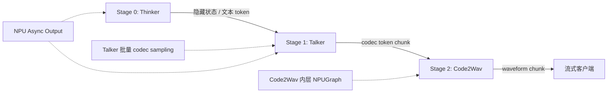
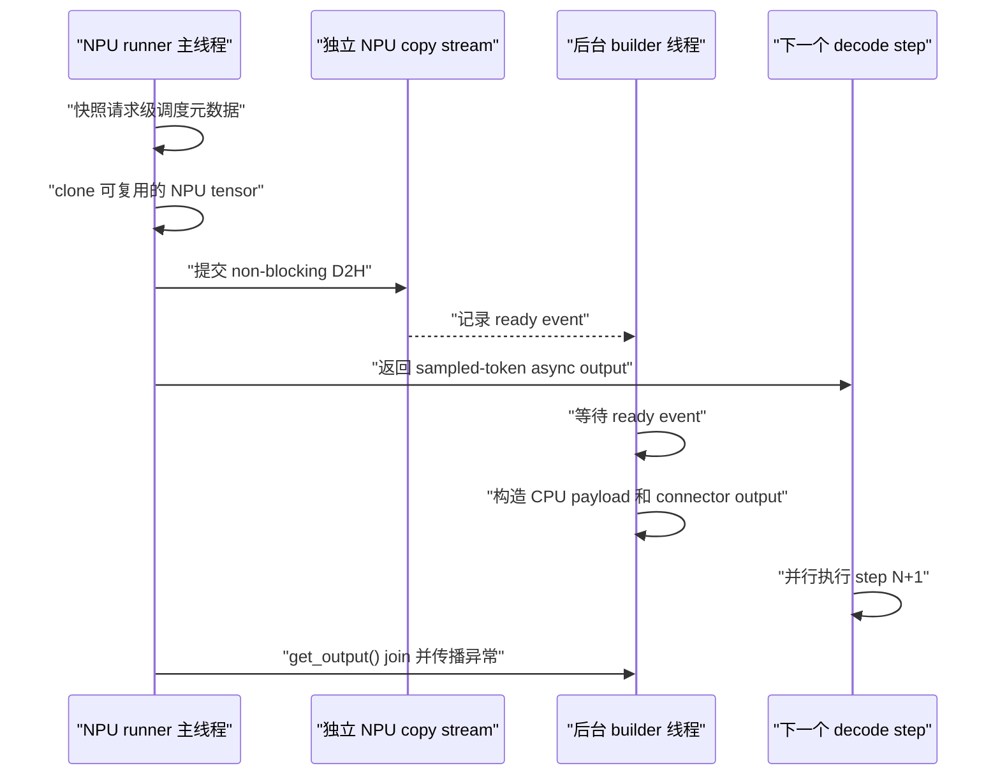

# MiniCPM-o 4.5 流水线性能优化原理方案

## 1. 背景与范围

MiniCPM-o 4.5 的语音生成采用三阶段流水线：

| 阶段 | 组件 | 主要职责 |
| --- | --- | --- |
| Stage 0 | Thinker | 多模态理解及文本 token 生成 |
| Stage 1 | Talker | 将文本隐藏状态转换为音频 codec token |
| Stage 2 | Code2Wav | 将 codec token 转换为流式波形数据 |

本文统一说明以下三个优化点：

1. [PR #5792](https://github.com/vllm-project/vllm-omni/pull/5792)：将
   Stage 1 Talker 的 codec sampling 从按请求串行改为批量处理。
2. [PR #5604](https://github.com/vllm-project/vllm-omni/pull/5604)：将
   Stage 2 Code2Wav 中稳定的 CFM DiT estimator 计算区域接入 NPUGraph。
3. [PR #6184](https://github.com/vllm-project/vllm-omni/pull/6184)：为 NPU
   AR runner 增加 Async Output，将 Omni 输出构造从下一步 decode 的关键路径移走。

三项优化解决的是同一条流水线上的不同问题：

- Talker 批量采样减少并发请求之间重复的 Python 调度和 NPU 同步；
- Code2Wav NPUGraph 减少固定计算区域内重复的算子下发开销；
- Async Output 将 D2H 和 CPU payload 构造与下一步 NPU decode 重叠。



## 2. 原始性能瓶颈

优化前，一次流式迭代中存在三类可以消除的串行点：

```text
Talker forward
  -> request 0: projection/filter/sample/.item()
  -> request 1: projection/filter/sample/.item()
  -> ...
  -> request N: projection/filter/sample/.item()
  -> 同步执行 hidden states 和 multimodal outputs 的 D2H
  -> 同步构造并序列化跨 stage payload
  -> 启动下一个 Talker decode step
  -> Code2Wav 再次逐个下发相同的 CFM DiT 算子
```

因此，提高并发数不仅会增大 tensor 的 batch 维度，还会线性增加 Python 循环、
小算子下发和 device-to-host 同步次数。NPU 计算和 CPU 输出处理之间也缺少重叠。

## 3. Stage 1 Talker 批量 Codec Sampling

### 3.1 问题分析

原实现中，`MiniCPMO45OmniTTSForConditionalGeneration.make_omni_output()`
会针对每个活跃请求串行调用一次 `_sample_audio_code()`。并发数为 `B` 时，
每个 decode step 都要重复执行 `B` 次：

- `head_code[0]` codec 词表投影；
- 基于请求历史的 repetition penalty；
- EOS mask；
- top-p、top-k 过滤；
- softmax；
- multinomial sampling；
- `Tensor.item()` 及其引起的 D2H 同步。

这些请求已经到达同一个 Talker 输出阶段，hidden row 可以组成 batch，原实现却仍按
请求执行完整 tensor 计算和同步。

### 3.2 优化方案

优化后的 `make_omni_output()` 先扫描请求元数据，但不立即采样。所有满足采样条件的
请求会形成 `_PendingCodecSample`，随后统一调用一次 `_sample_audio_codes()`：

```text
遍历请求元数据
  -> 收集 eligible hidden row、history、request ID 和 step
  -> 拼接为 [B, H]
  -> 批量 codec projection，得到 [B, V]
  -> 批量 repetition penalty
  -> 批量 EOS mask、top-p、top-k 和 softmax
  -> 使用每请求独立 RNG 执行 multinomial
  -> 一次批量 D2H 获取 sampled IDs
  -> 分别更新每个请求的 codec 状态和 stop 状态
```

主要 tensor 路径变为：

```python
logits = self.head_code[0](hidden_states).float() / temperature
logits = _apply_batched_repetition_penalty(logits, histories, ...)
logits[:, eos_id].masked_fill_(mask_eos, float("-inf"))
logits = _apply_top_k_top_p(logits, ...)
probabilities = torch.softmax(logits, dim=-1)
```

采样结果统一传回 CPU：

```python
sampled_ids = sampled_batch.detach().to(device="cpu").tolist()
```

这将每个请求一次的 `.item()` 同步，减少为每个 Talker step 一次批量 D2H 同步。

### 3.3 为什么 Multinomial 仍然逐行执行

`torch.multinomial()` 的一次调用只能接收一个 `torch.Generator`。如果整个 batch
共用一个 generator，某个请求的输出会受到以下因素影响：

- 请求在 batch 中的顺序；
- 其他请求结束后引起的 batch compaction；
- 无关请求进入或退出 scheduler。

因此实现保留了每请求一个 generator，只将最终的 multinomial draw 逐行执行。
projection、penalty、filter 和 softmax 仍然是批量计算。这是保证请求级确定性的边界，
不是遗漏的优化。

### 3.4 Repetition Penalty 的显存控制

不同请求拥有不同 codec 历史。实现使用如下编码方式将多行历史交给
`torch.bincount()`：

```text
encoded_token = token_id + row_id * vocab_size
```

`bincount` 的结果再 reshape 为 `[B, V]`，得到每个请求各自的 token frequency。

如果直接为高并发分配完整的 `B * V` int64 workspace，临时显存开销会很大。因此，
repetition penalty 每次最多处理 16 个请求，并直接写入预分配的最终 logits buffer。
这样既限制了临时 workspace，又不会退回原来的逐请求 projection 和逐请求同步。

### 3.5 保持不变的请求语义

以下状态仍严格按请求维护：

- 最小和最大 codec token 数；
- EOS 和 stop flag；
- incomplete prefill 的采样资格；
- repetition history；
- RNG generator 和 seed 推进；
- 发送给 Stage 2 的 codec delta；
- 全双工 epoch、turn ID、文本和 turn-end 元数据。

`stop_flags` 默认表示继续。只有之前已经结束或本次新结束的请求才会停止；
ineligible prefill row 不能推进 codec 状态或 RNG 状态。

### 3.6 优化边界与预期收益

| 项目 | 优化前 | 优化后 |
| --- | --- | --- |
| Codec projection 和 logits 处理 | `B` 次小调用 | 一次 batch 调用 |
| Sampled ID D2H 同步 | 最多 `B` 次 `.item()` | 一次 batch 传输 |
| Multinomial | `B` 次请求级调用 | 仍为 `B` 次请求级调用 |
| 请求状态更新 | 请求级 | 请求级 |

PR #5792 没有声明端到端实测收益。理论上并发越高，消除串行 projection 和同步的
收益越明显，但仍需要使用并发 1/4/8 或更高的场景，对比 Stage 1 output latency、
TTFP、吞吐和 sampling 峰值显存。

## 4. Stage 2 Code2Wav 内层 NPUGraph

### 4.1 为什么不能将整个 Code2Wav 入图

Code2Wav 不是一个固定 shape 的纯 tensor 函数，其完整路径包含 Python 逻辑和
请求级流式状态：

| 计算区域 | 执行方式 | 原因 |
| --- | --- | --- |
| 请求解析和状态提交 | Eager | Python dictionary 和请求级状态所有权 |
| Flow encoder | Eager | 动态 chunk 和 streaming cache 边界 |
| Timestep embedding | Eager | 上游实现会创建 CPU tensor 并执行 H2D |
| CFM DiT `blocks_forward_chunk()` | NPUGraph | 确定性的纯 tensor、exact-shape 计算 |
| HiFT 和 waveform overlap | Eager | 随机 phase 和可变 overlap 状态 |

因此 Stage 2 的 vLLM generation runner 仍保持 `enforce_eager: true`。NPUGraph
是由 Ascend platform patch 管理的内层图，与 Stage 0/1 的 PIECEWISE graph
不是同一层级。

### 4.2 入图计算范围

图覆盖主要的 CFM estimator body：

1. 构造 speaker features；
2. 拼接 `x`、`mu`、speaker features 和 conditioning；
3. 准备 estimator CNN/attention 输出 buffer；
4. 调用 `estimator.blocks_forward_chunk()`；
5. 返回 estimator 输出及更新后的 CNN/attention cache。

`estimator.t_embedder(time).unsqueeze(1)` 在 graph dispatch 之前 eager 执行。
这样可以把会创建 host frequency tensor 的逻辑排除在 capture 之外，同时保持原始
timestep schedule 不变。

### 4.3 Exact-signature Graph Cache

`NPUExactGraphRunner` 使用以下信息构造 graph key：

```text
(operation, constant mode, 每个 tensor 的 shape、dtype 和完整 device)
```

有 cache 和无 cache 的 estimator 调用使用不同 constant mode，因此会进入不同的
graph entry。不同 shape、dtype、device 或 cache 布局不会错误复用同一个图。

新 signature 的生命周期为：

```text
第一次调用
  -> eager 执行，初始化 lazy kernel 和 allocator 状态
  -> clone static inputs
  -> 使用 vLLM global graph pool capture
  -> 返回本次 eager 结果

后续相同 signature
  -> 将当前 tensor copy 到 static inputs
  -> replay NPUGraph
  -> clone graph persistent outputs
  -> 返回请求独占的结果和 cache tensor
```

graph output 必须 clone。NPUGraph output buffer 是持久 buffer，下一次 replay 会覆盖
它。如果直接把 output 保存为某个请求的 streaming cache，其他请求的 replay 会破坏
该请求的历史状态。

### 4.4 Graph 数量限制和失败策略

`code2wav_max_npu_graphs` 默认值为 32。达到上限后，新的 signature 回退 eager，
已有 signature 继续 replay，避免 graph pool 显存无限增长。

capture 异常按照进程级失败处理。部分 torch-npu capture 失败会使 allocator 或
capture 状态失效，在同一 Stage 2 进程中静默回退并不安全。报错会要求重启 Stage 2，
并选择修复 capture 条件或关闭该 graph 功能。

### 4.5 Ascend Runtime 前置条件

graph 模式下，在 Token2Wav 加载之前设置：

```python
torch.npu.config.allow_internal_format = False
torch.npu.set_compile_mode(jit_compile=False)
```

同时拒绝 `ASCEND_LAUNCH_BLOCKING=1`，并在 graph 覆盖的 flow 路径中强制使用
MATH SDPA backend。这些约束用于选择可 capture 的 ACLNN kernel，并避免隐藏的同步
行为破坏 capture。

所有 NPU patch 和 graph helper 均位于 `vllm_omni/platforms/npu/`。通用 MiniCPM
模型代码不直接依赖 `torch_npu` 或 `vllm_ascend`。

### 4.6 配置方式

Stage 2 graph 与 Stage 0/1 一样，通过 platform 下的 stage override 配置：

```yaml
platforms:
  npu:
    stages:
      - stage_id: 0
        compilation_config:
          cudagraph_mode: PIECEWISE
      - stage_id: 1
        compilation_config:
          cudagraph_mode: PIECEWISE
      - stage_id: 2
        additional_config:
          code2wav_enable_npu_graph: true
          code2wav_max_npu_graphs: 32
```

设置 `code2wav_enable_npu_graph: false` 只会关闭 Stage 2 内层 capture，不影响
Stage 0/1 graph。

### 4.7 已测结果

用户在同一 Ascend Stage 2 workload 上完成的 A/B 测试显示：相比 eager，启用
内层 NPUGraph 后 Stage 2 TTFT 约下降 15%。该数据是 Stage 2 局部指标，不能在没有
独立端到端测试的情况下表述为整个 MiniCPM-o 流水线提升 15%。

## 5. NPU Async Output

### 5.1 问题分析

NPU async scheduling 原先只异步处理 sampled token 的 D2H。在
`sample_tokens()` 创建异步 wrapper 之前，完整 `OmniModelRunnerOutput` 已经同步
构造完成。以下操作仍阻塞 worker 主线程：

- hidden states D2H；
- multimodal outputs D2H；
- 请求级 tensor 切分和 Python object 构造；
- inter-stage streaming payload 构造；
- connector 序列化和 signal 收集。

只有这些工作完成后，runner 才能启动下一个 AR decode step。

### 5.2 Deferred Builder 方案

NPU 实现复用 GPU deferred-builder 思路，但使用 NPU 原生 stream、event 和 device
接口：



主线程只保留下一步 scheduler 必需的工作：

1. 快照 request ID、request-to-batch 映射、scheduled token 数、query offset 等
   step-local 元数据；
2. clone 可能指向 model output 或 graph reusable buffer 的 NPU tensor；
3. 在独立 `torch.npu.Stream` 上向 pinned CPU tensor 提交 non-blocking copy；
4. 记录 `torch.npu.Event`；
5. 注册 sampled-token feedback 并返回 async wrapper。

后台 daemon thread 显式调用 `torch.npu.set_device()`，等待 payload event，然后只做
CPU output assembly。后台线程不能重新读取 `self.input_batch` 或
`self.query_start_loc`，因为下一个 scheduler step 可能已经修改了这些对象。

`get_output()` 是生命周期和异常边界：负责 join builder、重新抛出后台异常，并完成
sampled token 异步结果的最终处理。

### 5.3 Tensor 所有权

D2H 之前必须先 clone，原因与 NPUGraph output clone 一致：下一步 decode 可能在 copy
stream 读取源 tensor 时复用或覆盖原 buffer。snapshot object 会持有 clone 后的 NPU
source，直到 ready event 完成后再释放。

实现需要递归处理 dictionary、list 和 tuple 中的 tensor。非 NPU 对象保持不变；
D2H 目标使用 pinned host memory，保证 `copy_(..., non_blocking=True)` 具备与设备
计算重叠的条件。

### 5.4 启用条件

只有满足状态生命周期约束时，才能使用 async path：

| 条件 | 原因 |
| --- | --- |
| 开启 AR async scheduling | scheduler 必须能提前进入下一步 |
| `async_chunk: true` | 输出必须按 chunk 增量下发，而不是同步累积完整 payload |
| 关闭 Omni prefix cache | prefix-cache merge/update 状态尚未被安全快照 |
| 关闭 speculative decoding | 当前 snapshot 不覆盖 speculative output 状态 |
| 关闭 routed-expert output | routed-expert 提取仍依赖同步路径 |

NPU Async Output 可通过以下环境变量关闭：

```bash
export VLLM_OMNI_NPU_ASYNC_OUTPUT=0
```

Async Output 与 Async Chunk 不是同一功能：

- Async Chunk 通过提前转发部分输出，让相邻 stage 重叠执行；
- Async Output 让一个 AR step 的 CPU 输出构造与下一个 device decode step 重叠。

### 5.5 已测结果与代价

PR #6184 给出的 Ascend 910C、单并发、五轮平均数据如下：

| 指标 | 优化前 | 优化后 | 变化 |
| --- | ---: | ---: | ---: |
| TTFT | 317 ms | 266 ms | -16% |
| TTFP | 776 ms | 757 ms | -2.5% |
| RTF | 0.39 | 0.40 | +2.5% |
| WER | 0.0107 | 0.0107 | 不变 |
| ASV | 0.8433 | 0.8433 | 不变 |

RTF 的 2.5% 回退是实际代价：clone 和 D2H snapshot 会与 memory-bound Talker
decode 争用 HBM 带宽。并发提高后，还会增加 snapshot 开销和 host thread contention。
因此初期更适合低并发、TTFT 敏感场景，并应保留开关，直到并发 4/8 的结果满足部署
目标后再扩大默认启用范围。

## 6. 三项优化的组合关系

三项优化位于不同边界，组合后的执行顺序为：

```text
Stage 1 Talker step N
  -> model forward
  -> 收集所有 eligible request
  -> 批量 projection/filter，使用请求级 RNG 采样 codec ID
  -> eager 更新每请求 codec/RNG/stop 状态
  -> 异步 snapshot 并构造对外 Omni payload
  -> 启动 Talker step N+1

Stage 2 收到 codec chunk N
  -> eager 请求和 chunk 准备
  -> eager timestep embedding
  -> exact-signature CFM estimator NPUGraph replay
  -> eager HiFT 和 waveform overlap
  -> 向客户端发送 waveform chunk
```

Stage 1 sampling 状态不能放到后台，因为下一个 Talker step 需要本次 sampled codec
token。只有完成状态提交后的 payload materialization 可以异步执行。

Stage 2 NPUGraph 与 Stage 1 后台 builder 在执行上独立，但两者都依赖正确的 tensor
所有权：异步输出 snapshot 和 graph persistent output 都不能与后续 step 或其他请求
复用的 buffer 发生别名共享。

## 7. Profiling 预期变化

### 7.1 Talker 批量采样后

- 原来每个请求一个 codec projection，变为一个较大的 batch projection；
- top-k、top-p、softmax 以 batch operator 形式出现；
- sampled ID 每个 Talker step 只出现一次批量 D2H；
- 仍可看到少量逐行 `multinomial`，这是请求级 RNG 语义要求。

### 7.2 Code2Wav NPUGraph 后

- 每个新 exact signature 先出现 eager warmup 和 capture；
- 后续相同 signature 由 NPUGraph replay region 替代逐个下发的 CFM DiT block；
- timestep embedding、flow 边界、HiFT 和 overlap-add 仍在图外可见。

host timeline 上看不到独立 CFM 算子，不表示这些算子被删除。它们在 graph 内执行，
需要结合 graph replay marker 和 NPU activity 判断是否真正入图。

### 7.3 Async Output 后

- `omni_async_npu_output:build` 出现在后台 host thread；
- D2H 出现在独立 NPU copy stream；
- step `N` 的 output build 与 step `N+1` 的 device compute 发生重叠；
- 相邻 Thinker/Talker decode step 之间的 host gap 缩短。

## 8. 正确性与性能验证方案

### 8.1 正确性矩阵

| 模块 | 必测内容 |
| --- | --- |
| Talker batching | 固定 seed 等价性、请求重排、batch compaction、EOS/min/max、incomplete prefill、native duplex |
| NPUGraph | eager/replay tensor 对比、有/无 cache、exact-shape 路由、output ownership、capture failure |
| Async Output | sync/async 输出等价、metadata race、graph buffer 复用、后台异常传播、connector 顺序 |
| 端到端 | 文本和音频完整性、chunk 顺序、WER/ASV、取消请求和并发请求隔离 |

### 8.2 性能矩阵

A/B 测试必须使用相同模型、prompt 集合、NPU 软件栈、warmup 次数和生成音频长度。

| 维度 | 建议取值 |
| --- | --- |
| 并发 | 1、4、8 |
| Stage 2 graph | off/on |
| Async Output | off/on |
| 输入 | 文本、音频、交错多模态 |
| 输出 | 文本 + 流式音频 |

至少采集：

- 端到端 TTFT 和 audio TTFP；
- Stage 1 output-processing latency；
- Stage 2 首 chunk latency 和稳态 chunk latency；
- request throughput 和 audio RTF；
- p50、p90、p99 latency；
- 峰值 NPU memory 和 graph cache entry 数；
- 请求成功率、WER 和 ASV。

应先分别测试每个 feature，再测试组合配置，避免把重叠收益重复计算。

## 9. 上线与回退方案

建议按以下顺序上线：

1. 启用 Talker batching，完成确定性测试和并发 profiling；
2. 启用 Stage 2 内层 NPUGraph，监控 capture/replay 次数和 graph memory；
3. 在低并发、TTFT 敏感的部署中启用 NPU Async Output；
4. 完成组合性能矩阵后，再决定高并发场景是否默认启用 Async Output。

各 feature 可独立回退：

| Feature | 回退方式 |
| --- | --- |
| Talker batching | 当前没有 runtime switch，需要回退对应代码提交 |
| Stage 2 NPUGraph | 设置 `code2wav_enable_npu_graph: false` 并重启 Stage 2 |
| NPU Async Output | 设置 `VLLM_OMNI_NPU_ASYNC_OUTPUT=0` 并重启 AR stage |

## 10. 总结

本方案不是尝试把整个 MiniCPM-o 流水线强行放入一个 graph，也不是把全部输出逻辑
移入后台，而是在每个稳定边界使用适合的执行方式：

- 对 shape 一致、请求间相互独立的 tensor 计算做 batching；
- 对 exact-shape、确定性的 NPU 计算区域做 graph replay；
- 在下一步模型状态已经提交后，再异步执行 CPU output materialization。

这种拆分在保留请求级 RNG、streaming cache 和全双工元数据语义的同时，减少了 host
串行和 NPU 算子下发开销。需要特别注意，Async Output 在高并发下存在 snapshot 带宽
和线程竞争代价，不能仅根据单并发 TTFT 数据得出所有场景都加速的结论。

